# Wazuh - SIEM

Hey there Fellow Geeks and Security Enthusiasts!! 
The purpose of this repository is to showcase my recent implementation of an end to end open-source SIEM solution, Wazuh. This included Installation and Setup , Integrating Multiple Windows and Linux Agents , Tweaking Rules and configuration to activate Vulnerability Detection and File Integrity Monitoring And Integrating MISP and AlientVault. The overall Architecture Looks Something Like this

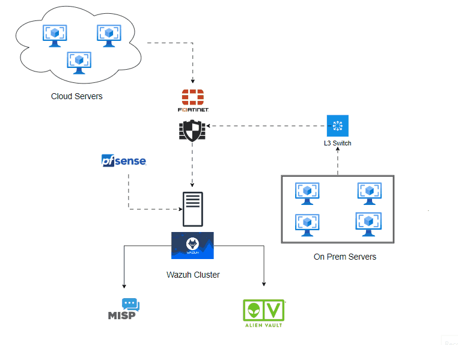

## ⚡ Installation And Initial Setup

The installation was Done by using the OVA file provided by the community. I went for a stand-Alone installation i.e I have the Manager , dashboard and a one node of indexer all on the same virtual machine. I have around 100+ Active Agents Integrated with the Manager.

### ✨ Rules and Decoders 
I had to modify and add some new rules and Decoders provided by default in order to tailor it according to my needs. 

In order to add new rules, add a file with the format **<id>-malware-rules.xml** to the **/var/ossec/ruleset/rules** directory. However , Make sure that the rule IDs in any two files do not overlap , Specifically for two different rules.

### ✨ Agents

#### ⭕️ Windows

For windows , I simply followed the basic installation method/command provided on the dashboard. As an Addition I also installed and configured sysmon in windows for targetting the network level logs

#### ⭕️ Linux
For linux, After installing the agent I installed a few more components for effective log aggregation. These components included  
✅Sysmon For Linux  
✅Packetbeat  
✅Auditd With modified ruleset

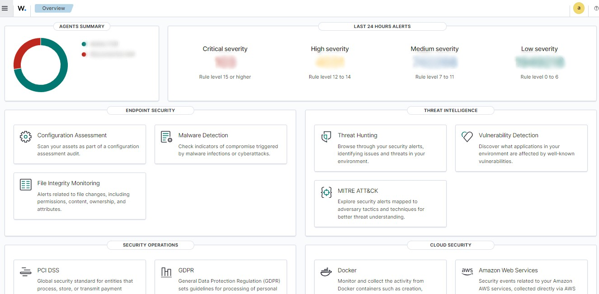

### ✨ Agent Groups  
Agent Groups can be used to classify and categorize your agents based on projects, departments or even organizations. You can then use a different agent config files based on what group it is

## ⚡ Vulnerability Detection
Vulnerability detection in Wazuh helps identify weaknesses in your systems that could be exploited by attackers. What wazuh does is it basically scans your system for known vulnerabilities. It regularly checks for outdated software or misconfigurations and provides alerts so you can fix potential security risks. It helps me manage an inventory of vulnerabilities in all my agents. This way I can keep a track and visualize the progress over the months.

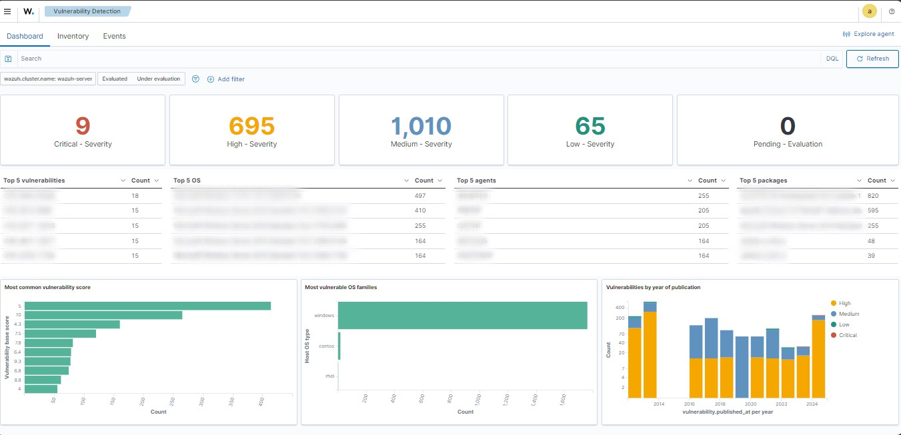

## ⚡ File Integrity Monitoring
File integrity monitoring (FIM) in Wazuh tracks changes to important files and directories on your system. It detects if any critical files are modified, added, or deleted, which could indicate a security breach or malware activity. Not just that, it also makes difficult for people to modify system critical files and deny doing it 😉

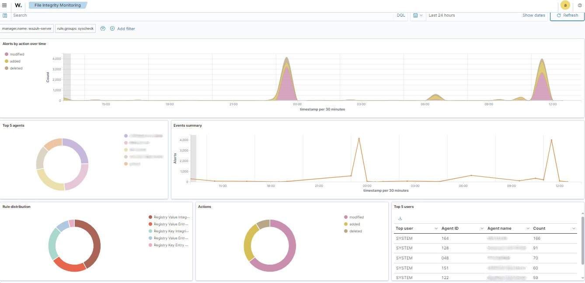

## ⚡Security Frameworks

Another thing which really fascinated me was integration with frameworks like NIST and MITRE ATT&CK to help improve your security posture. NIST provides guidelines and best practices for managing cybersecurity risks, and we can use these guidelines to monitor and respond to security threats. MITRE ATT&CK, on the other hand, is a knowledge base of attacker tactics and techniques. Wazuh uses this framework to recognize attack patterns, providing better detection and response to security incidents.

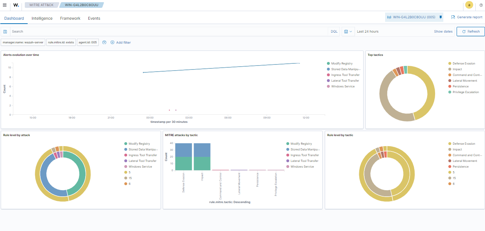
 
 
 
 
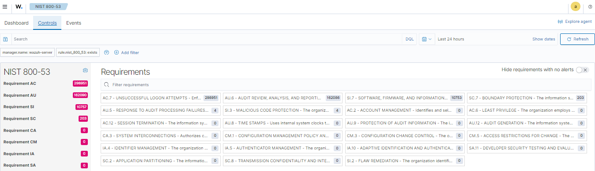
 
 
 
 

 
 
 
 
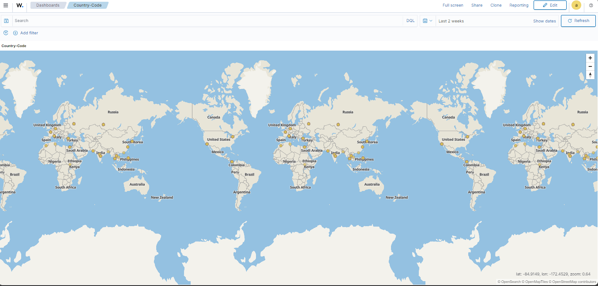

## ⚡ Configuration Management 

Before shifting to Wazuh, I always struggeled with keeping track of patches and security protocols across multiple servers. With Wazuh you can ensure that your system is set up securely and consistently. You can monitor system configurations get an alert if any settings are modified or deviate from your desired security standards. 

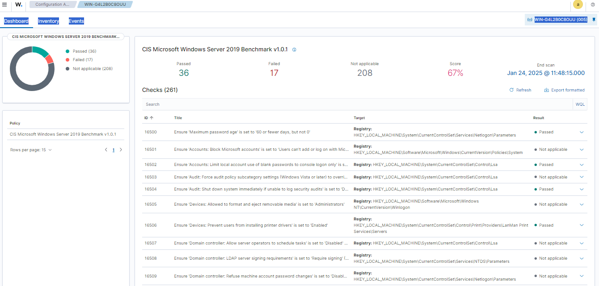

## ⚡ Malware Detection

This involves identifying malicious software running on your systems. Wazuh uses a combination of file scanning, behavioral analysis, and threat intelligence feeds to detect suspicious activities related to malware. It looks for signs of known malware, unusual system behavior, and indicators like strange file changes or network traffic. When a malware is detected, it alerts you so you can take action to remove the threat and protect your systems.

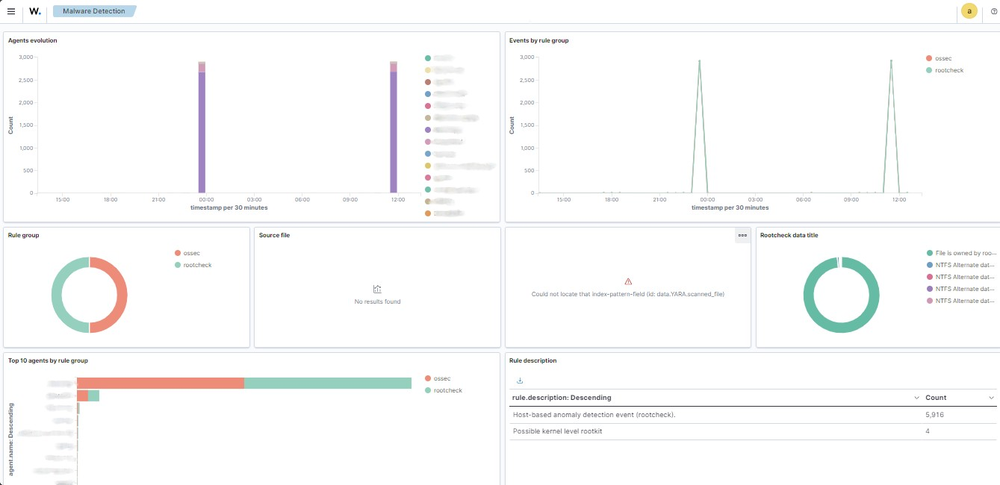

## Integration with Firewalls
I integrated wazuh with firewalls like fortinet and PFsense to collect and analyze log data for security monitoring using Syslog. Firewalls generate logs that contain information about network traffic, blocked connections, and security events. By integrating these logs with Wazuh, I could monitor firewall activity in real-time. 

## ⚡ Integration With MISP

MISP (Malware Information Sharing Platform) is a tool that allows organizations to share information about threats and attacks. I integrated Wazuh with MISP to enhance threat detection and response. This integration enables Wazuh to receive and act on threat intelligence feeds from MISP, such as indicators of compromise (IOCs) like IP addresses, file hashes, or domain names related to malware or attacks.

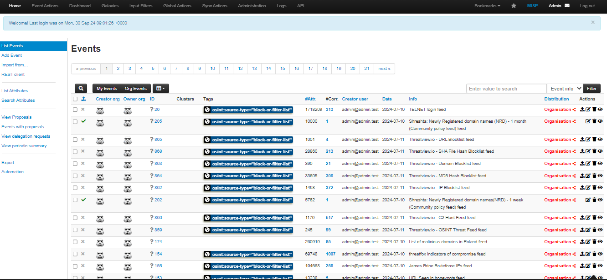
 
 
 
 
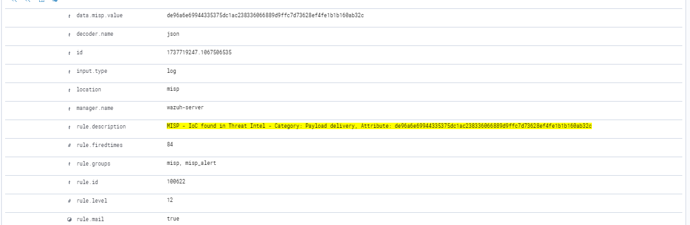